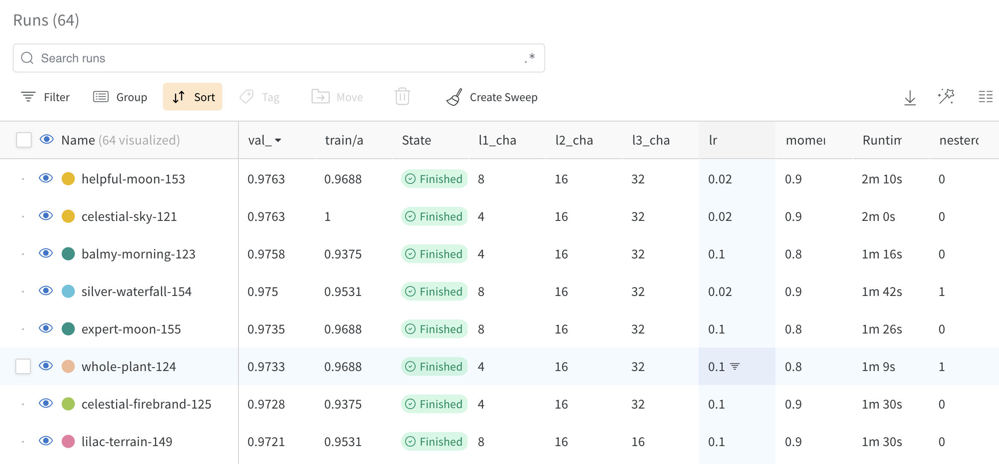
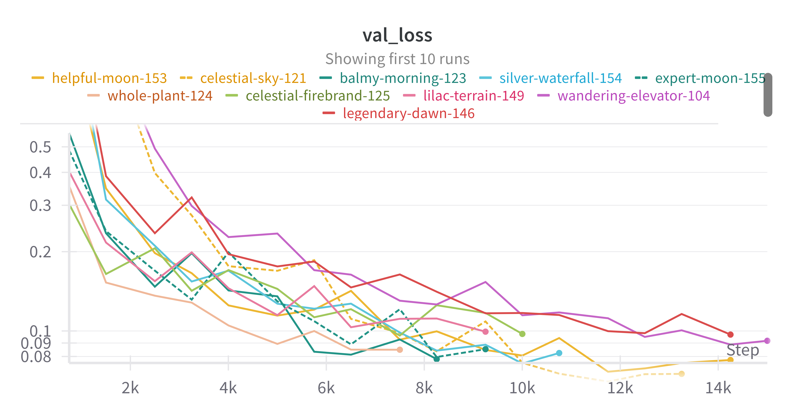
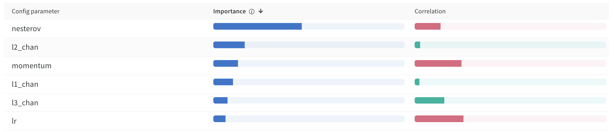
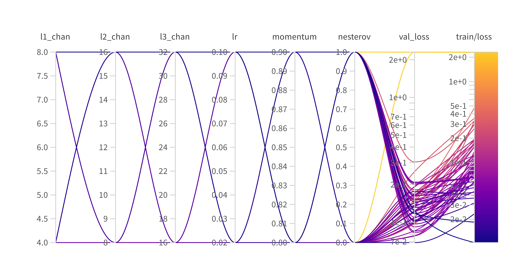
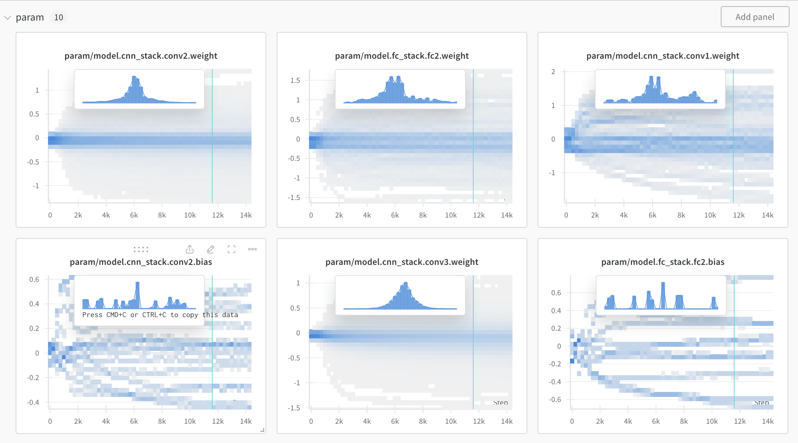
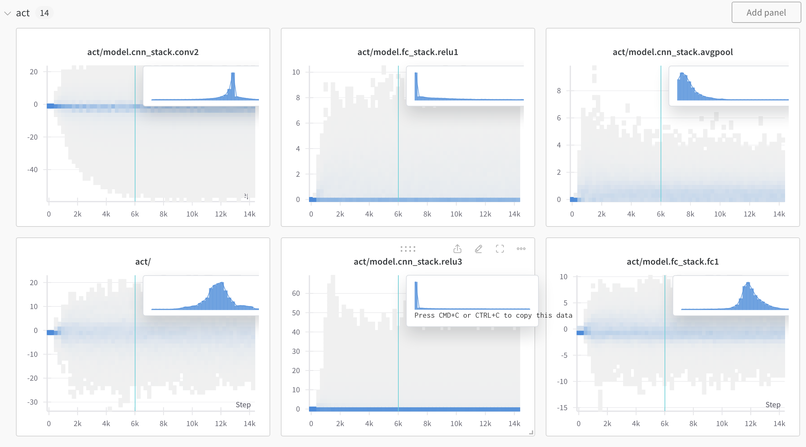
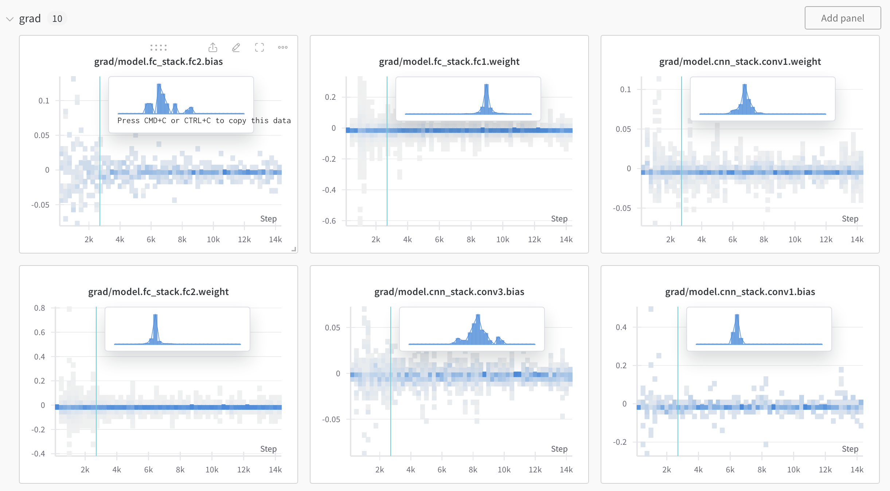

# PyTorch + Lightning + W&B + TensorBoard Reference Implementation

It is finally time for me to jump in the PyTorch pool. My office was closed for two weeks over the 2023/2024 holidays, so this was a perfect time to learn some new (to me) tools.

The key objective was to build a reference  implementation for a simple CNN for MNIST. From here, the plan is to implement more interesting things after getting the rust knocked off:

- Diffusion models
- Very small GPT-like model (e.g., nanoGPT)
- Low-bit quantization in PyTorch
- Graph neural networks

## Components of the Reference Implementation

A few updated approaches since last time I got my hands dirty:

- PyTorch Lightning : Get some feeling for what I like and what I don't
- YAML configuration (Hydra): Move away from CLI arguments to YAML configuration
- Weights & Biases : See what a slick experiment tracking tool can do
- TensorBoard : Still seems the go-to for basic training montoring
- Dev Containers : Move from PyCharm to VS Code and give dev containers a try
- TODO: Add type hinting to make my code less readable

## Setup

1. Create VM on cloud provider of your choice

Some notes:

- Be sure to enable http traffic (for TensorBoard)
- Open port 6006 (both directions - also for Tensorboard)
- Make sure GPU driver is installed
- Confirm docker is installed

2. Build container

Copy `Dockerfile` to your VM, or just clone this repo.

`git clone --depth 1 https://github.com/pat-coady/pytorch-sandbox.git`

Build it. Run command from directory containing the `Dockerfile`:

`docker build -t mnist0 .` 

3. Run container

Put your Weights & Biases API Key in your environment.

`export WANDB_API_KEY=<your API key>`

Run the container detached. We'll connect to the container in the next step using `docker exec` to start training and tensorboard. Yes, I know, containers aren't really meant to be used interactively like this. But it is pretty handy for having a fixed development environment and replicating almost anywhere.

`docker run --gpus all -p 6006:6006 -e WANDB_API_KEY -td mnist0`

4. Train a model and monitor results via TensorBoard

Start `tmux` so you can launch training and start TensorBoard server. Also easy way to prevent your job from dying if you disconnect your ssh session (which can happen **very** easily if your computer goes to sleep or your network glitches).

`tmux`

Here is an example hyperparameter sweep using the hydra interace:

```
cd pytorch-sandbox

python3 train.py -m data.num_workers=4 trainer.max_epochs=20 \
model.l1_chan=4,8 model.l2_chan=8,16 model.l3_chan=16,32 \
model.optimizer_params.lr=0.02,0.1 model.optimizer_params.momentum=0.8,0.9 \
model.optimizer_params.nesterov=0,1
```

Start another pane in `tmux` to launch tensorboard and monitor training: `CNTL-b c`. Here is a nice [tmux tutorial](https://hamvocke.com/blog/a-quick-and-easy-guide-to-tmux/) if you aren't familar.

Launch tensorboard (`--bind_all` to serve externally):

`tensorboard --bind_all --logdir .`

To detach from tmux: `CNTL-b d`. You can now walk away from things, close ssh, and everything should keep on running.

## Results

I've made the Weights and Biases workspace for this project if you want to look around:

https://wandb.ai/pcoady00/mnist/workspace

This contains the results of the 64-run hyperparameter sweep I ran above. Here are some screen shots. Here is a [quick (not narrated) video](https://youtu.be/CWLoKN_3Cz0) that explores results.

And here some representative screen shots.


**Figure 1.** *Results sorted by validation accuracy.*


**Figure 2.** *Training curves: validation loss.*


**Figure 3.** *Parameter importance and positive (GREEN) or negative (RED) correlation.*


**Figure 4.** *"Parallel Coordinates" view, somewhat useful when used interactive -- see video.*


**Figure 5.** *Parmeter histograms, can be somewhat informative to debug training and where learning is occuring.*


**Figure 6.** *Also useful for monitoring training.*


**Figure 7.** *Good to check ... for instance, would gradient clipping or batch normalization be useful?*

## Acknowledgements

I'd like to thank Tao Yu and Zsolt Majzik on my team for giving me some really helpful pointers as I got started.